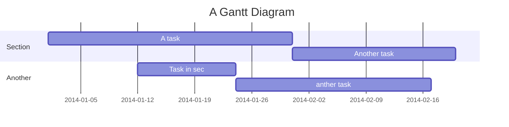

MKS 門禁機(RPI) Documentation
===
<!-- 

 -->

## Table of Contents

[TOC]

## Rpi Python Code

<!-- If you are a total beginner to this, start here! -->
1. globals.py
---
```gherkin=
global ID_number
ID_number = ""
global name
name = ""
global state
state = 'init'
```
:::info
* There are 3 states: init, registered, unregistered
* Global veriables can be accessed by other python file
:::
2. upload.py
---

```gherkin=
import sys
import time
import datetime
import gspread
import json
import signal
import globals
from oauth2client.service_account import ServiceAccountCredentials as SAC
from datetime import date, datetime

def uploadtoGsheet(UID,purpose):
    GDriveJSON = 'pythonupload.json'
    GSpreadSheet = 'UploadByPython'

    try:
        scope = ['https://spreadsheets.google.com/feeds',
                    'https://www.googleapis.com/auth/drive']
        key = SAC.from_json_keyfile_name(GDriveJSON, scope)
        gc = gspread.authorize(key)
        worksheet = gc.open(GSpreadSheet).sheet1
    except Exception as ex:
        print('無法連線Google試算表', ex)
        sys.exit(1)

    recordtime = datetime.now()
    try:
        cell = worksheet.find(UID)
        globals.ID_number = worksheet.cell(cell.row, 4).value
        globals.name = worksheet.cell(cell.row, 3).value
        
    except:
        globals.ID_number = ""
        globals.name = ""

    worksheet.append_row((recordtime.strftime("%d/%m/%Y"), 
        recordtime.strftime("%H:%M:%S"),globals.name, globals.ID_number ,purpose,"",UID))

    if globals.ID_number == "" or globals.name == "" or purpose == "":
        globals.state = 'unregistered'
    
    else:
        globals.state = 'registered'

```
:::warning
* GDriveJSON = 'pythonupload.json':
    * the .json file has to be in the same folder with all other python files
* GSpreadSheet = 'UploadByPython':
    * this name has to correspond to the name on the google excel 
:::
:::info
* cell = worksheet.find(UID):
    * the code will collapse if UID is not found by this fuction, therefore, try: except: is necessary
* recordtime.strftime("%d/%m/%Y"):
    * this function return the current time in the d/m/y format
:::
>Details for how to connect to google excel via python:
https://sites.google.com/site/zsgititit/home/python-cheng-shi-she-ji/shi-yongpython-shang-chuan-zi-liao-daogoogle-shi-suan-biao
3. loginsystem.py
```gherkin=
import serial
import time
import globals
from upload import uploadtoGsheet
from display import display_registered, display_default, display_unregistered

purposeList = [
    "MKS管理",
    ....
    "個人/其他"
]

if __name__ == '__main__':
    ser = serial.Serial('/dev/ttyUSB0', 9600, timeout=1)
    ser.flush()
    while True:
        line = ser.readline().decode('utf-8').rstrip()
        UID = line[:8]
        purpose = line[9:]
        if line != "" and purpose != "":
            ser.write(b"Hello from Raspberry Pi!\n")
            
            print("UID is :", UID)
                
            for i in range (0,len(purpose),2):
                print(purposeList[int(purpose[i])]) 
                #end of receiving from mega, start to upload to Gsheet
                uploadtoGsheet(UID,purposeList[int(purpose[i])])

            #end of upload to Gsheet,begin to display on the screen
            if globals.state == 'registered':
                display_registered()
            else:
                display_unregistered()
        elif line != "":
            globals.state = 'missing button'
            display_default()
        else:
            display_default()
```
4. display.py
```gherkin=
import time
import globals
from RPLCD.i2c import CharLCD
from datetime import date, datetime


lcd = CharLCD(i2c_expander='PCF8574', address=0x3f, port=1,
        cols=20, dotsize=8,
        charmap='A02',
        auto_linebreaks=True,
        backlight_enabled=True)

def display_registered():
    lcd.clear()
    # ID_number = upload.ID_number
    print(globals.ID_number)
    lcd.write_string('Welcome! ')
    lcd.write_string(globals.ID_number)
    time.sleep(2)
    
def display_default():
    # print(globals.state)
    if globals.state != 'default':
        lcd.clear()
        globals.state = 'default'
        lcd.write_string(datetime.now().strftime('%H:%M:%S'))
        lcd.crlf()
        lcd.write_string('Press the button andscan the ID card')
    else:
        lcd.cursor_pos = (0,0)
        lcd.write_string(datetime.now().strftime('%H:%M:%S'))
        
def display_unregistered():
    lcd.clear()
    lcd.write_string('Unregistered!\n\rPlease contact the \n\radmin')
    time.sleep(2)
```
<!-- #default: 時間:先按按鈕 再刷卡 
#刷完:  1. 學號 歡迎 -->
:::warning
* address=0x3f the address can be accessed by i2cdetect -y 1
:::
:::info
* lcd.clear() clean the lcd screen
* lcd.crlf() = /n
* lcd.cursor_pos = (0,0) set the pos to origin to overwrite the previous time
:::
<!-- 4. Start writing note!

```gherkin=
Feature: Shopping Cart
  As a Shopper
  I want to put items in my shopping cart
  Because I want to manage items before I check out

  Scenario: User adds item to cart
    Given I'm a logged-in User
    When I go to the Item page
    And I click "Add item to cart"
    Then the quantity of items in my cart should go up
    And my subtotal should increment
    And the warehouse inventory should decrement
``` -->

> Read more about Gherkin here: https://docs.cucumber.io/gherkin/reference/
## Arduino C++ code
```gherkin=
#include <SPI.h>
#include <MFRC522.h>
#include "button.h"
#define RST_PIN         49
#define SS_PIN          53

MFRC522 mfrc522(SS_PIN, RST_PIN);  // Create MFRC522 instance

void setup() {
    Serial.begin(9600);     // Initialize serial communications with the PC
    while (!Serial);        // Do nothing if no serial port is opened (added for Arduinos based on ATMEGA32U4)
    SPI.begin();            // Init SPI bus
    mfrc522.PCD_Init();     // Init MFRC522
    setPins();
    //pinMode(31, OUTPUT);
    pinMode(13, OUTPUT);
}

void loop() {
  update();
  if ( ! mfrc522.PICC_IsNewCardPresent()) {
      return;
  }
  // Select one of the cards
  if ( ! mfrc522.PICC_ReadCardSerial()) {
      return;
  }
  tone(13, 2093, 100);
  String uid;
  for (int i = 0; i < 4; ++i) {
    String s = String(mfrc522.uid.uidByte[i], HEX);
    if (s.length() == 1)
      s = "0" + s;
    if (s.length() == 0)
      s = "00";
    uid += s;
  }
  mfrc522.PICC_HaltA();                         // 讓卡片進入停止模式
  mfrc522.PCD_StopCrypto1();
  bool purpose_list[12] = {false};
  String purpose;
  for (int i = 0; i < 12; ++i) {
    if (ledLightup[i]) { //lightup means the purpose has been selected
        purpose += ( " " + String(i)); 
    }
  }
//  byte result = 0; 
//  for(int i=0; i<12; i++){ //converting bool arraoy to bytes form
//    if(ledLightup[i]){
//       result |= (1 << i)
//    }
//  } 
  reset();
  Serial.println(uid + purpose);
  delay(1500);

}
```
:::info
This part was written by wish, ask him if detailed info is needed
:::

<!-- > Read more about sequence-diagrams here: http://bramp.github.io/js-sequence-diagrams/

Project Timeline
---


> Read more about mermaid here: http://mermaid-js.github.io/mermaid/ -->
## Bugs
### 1.螢幕時間還在跑，但卡片沒辦法感應
- 解法：斷電之後上電，重複直到卡片可以感應。（可能會需要兩三次）
- 試了多遍仍沒有辦法：請阿麵call我，對不起我爛。
### 2.螢幕當掉
- 解法：一樣斷電之後上電。
- 仍當機或螢幕什麼都沒有顯示：第一個是VScode解法：


- 確認筆電的Wifi是MKS-5G，點左下角綠色框框。

點選Connect to host

新增網址192.168.0.240
密碼是: loginsystem
在左邊explorer點選開啟資料夾，找一個叫LoginSystem的把它點開
再輸入一次密碼
成功連接之後應該長這個樣子：

- 在terminal 中輸入sudo systemctl status hello.service
應該要跳出這個畫面
如果是active(running)的話就代表應該不是rpi的問題，可能就要繼續試重新上電的方法或是請阿麵call我，QQ...
- 如果fail的話就會需要重新設定一些東西，請依序在terminal輸入以下指令：
``` unix=
sudo chmod 644 /lib/systemd/system/hello.service
chmod +x /home/pi/LoginSystem/loginSystem.py
sudo systemctl daemon-reload
sudo systemctl enable hello.service
sudo systemctl start hello.service
```
再回到上一部檢查
- 輸入剛剛一大堆的指令後，還是沒有active：
檢查一下內部的接線有沒有脫落，如果有，接上去之後重新輸入指令。以下是特別需要檢查的地方：
1. i2c接到rpi的藍色線
2. Lcd接到rpi的四條杜邦線
- 如果以上方法都行不通，就請阿麵call我吧
## References:
* Wiring：
>
* Service setting:
https://gist.github.com/emxsys/a507f3cad928e66f6410e7ac28e2990f
* Rpi to google excel：
https://sites.google.com/site/zsgititit/home/python-cheng-shi-she-ji/shi-yongpython-shang-chuan-zi-liao-daogoogle-shi-suan-biao

###### tags: `我爛` `嗚嗚嗚嗚嗚嗚`
`
